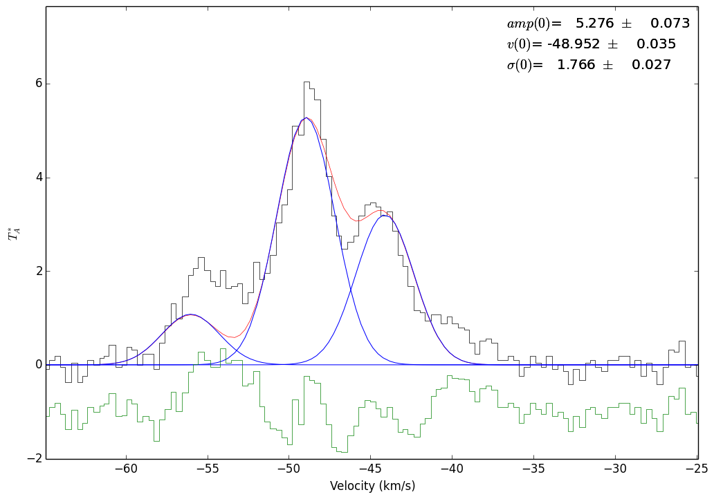

Radio Fitting: HCN example with freely varying hyperfine amplitudes
===================================================================

.. include:: <isogrk3.txt>

Example hyperfine line fitting for the HCN 1-0 line.

.. literalinclude:: ../examples/hcn_example.py
   :language: python

        Fit to the 3 hyperfine components of HCN 1-0 simultaneously.  The (0)'s indicate that this is the 0'th velocity component being fit

.. figure:: images/hcn_freehf_fit.png
        :alt: Fit to the 3 hyperfine components of HCN 1-0 simultaneously.  The (0)'s indicate that this is the 0'th velocity component being fit
        :figwidth: 650
        :width: 650

        Fit to the 3 hyperfine components of HCN 1-0 simultaneously.  The (0)'s indicate that this is the 0'th velocity component being fit

.. figure:: images/hcn_freehf_ampandwidth_fit.png
        :alt: Fit to the 3 hyperfine components of HCN 1-0 simultaneously.  The widths are allowed to vary in this example.
        :figwidth: 650
        :width: 650

        Fit to the 3 hyperfine components of HCN 1-0 simultaneously.  The widths are allowed to vary in this example.
