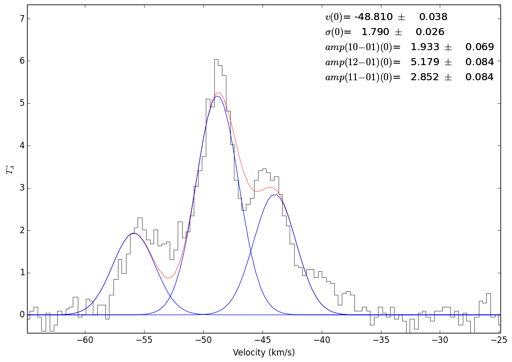

.. include:: <isogrk3.txt>

Radio Fitting: HCN example with freely varying hyperfine amplitudes
===================================================================

Example hyperfine line fitting for the HCN 1-0 line.

.. code-block:: python

    import pyspeckit

    # Load the spectrum & properly identify the units
    # The data is from http://adsabs.harvard.edu/abs/1999A%26A...348..600P
    sp = pyspeckit.Spectrum('02232+6138.txt')
    sp.xarr.units='km/s'
    sp.xarr.refX = 88.63184666e9
    sp.xarr.xtype='velocity'
    sp.units='$T_A^*$'

    # set the error array based on a signal-free part of the spectrum
    sp.error[:] = sp.stats((-35,-25))['std']

    # Register the fitter
    # The HCN fitter is 'built-in' but is not registered by default; this example
    # shows how to register a fitting procedure
    # 'multi' indicates that it is possible to fit multiple components and a
    # background will not automatically be fit 
    # 5 is the number of parameters in the model (line center,
    # line width, and amplitude for the 0-1, 2-1, and 1-1 lines)
    sp.Registry.add_fitter('hcn_varyhf',
                           pyspeckit.models.hcn.hcn_varyhf_amp_fitter,
                           5, multisingle='multi')

    # Plot the results
    sp.plotter()

    # Run the fitter and show the individual fit components
    sp.specfit(fittype='hcn_varyhf',
               multifit=True,
               guesses=[-53,1,0.2,0.6,0.3],
               show_hyperfine_components=True)

    # Save the figure (this step is just so that an image can be included on the web page)
    sp.plotter.savefig('hcn_freehf_fit.png')

    # now do the same thing, but allow the widths to vary too
    # there are 7 parameters:
    # 1. the centroid
    # 2,3,4 - the amplitudes of the 0-1, 2-1, and 1-1 lines
    # 5,6,7 - the widths of the 0-1, 2-1, and 1-1 lines
    sp.Registry.add_fitter('hcn_varyhf_width',
                           pyspeckit.models.hcn.hcn_varyhf_amp_width_fitter,
                           7, multisingle='multi')

    # Run the fitter
    sp.specfit(fittype='hcn_varyhf_width',multifit=True,
               guesses=[-53,0.2,0.6,0.3,1,1,1],
               show_hyperfine_components=True)

    # print the fitted parameters:
    print sp.specfit.parinfo
    # Param #0      CENTER0 =      -51.865 +/-       0.0525058
    # Param #1    AMP10-010 =      1.83238 +/-       0.0773993   Range:   [0,inf)
    # Param #2    AMP12-010 =      5.26566 +/-       0.0835981   Range:   [0,inf)
    # Param #3    AMP11-010 =      3.02621 +/-       0.0909095   Range:   [0,inf)
    # Param #4  WIDTH10-010 =      2.16711 +/-        0.118651   Range:   [0,inf)
    # Param #5  WIDTH12-010 =      1.90987 +/-       0.0476163   Range:   [0,inf)
    # Param #6  WIDTH11-010 =      1.64409 +/-        0.076998   Range:   [0,inf)

    # Save the figure (this step is just so that an image can be included on the web page)
    sp.plotter.savefig('hcn_freehf_ampandwidth_fit.png')

.. figure:: images/hcn_freehf_ampandwidth_fit.png
	:alt: Fit to the 3 hyperfine components of HCN 1-0 simultaneously.  The widths are allowed to vary in this example.
        :figwidth: 650
        :width: 650
