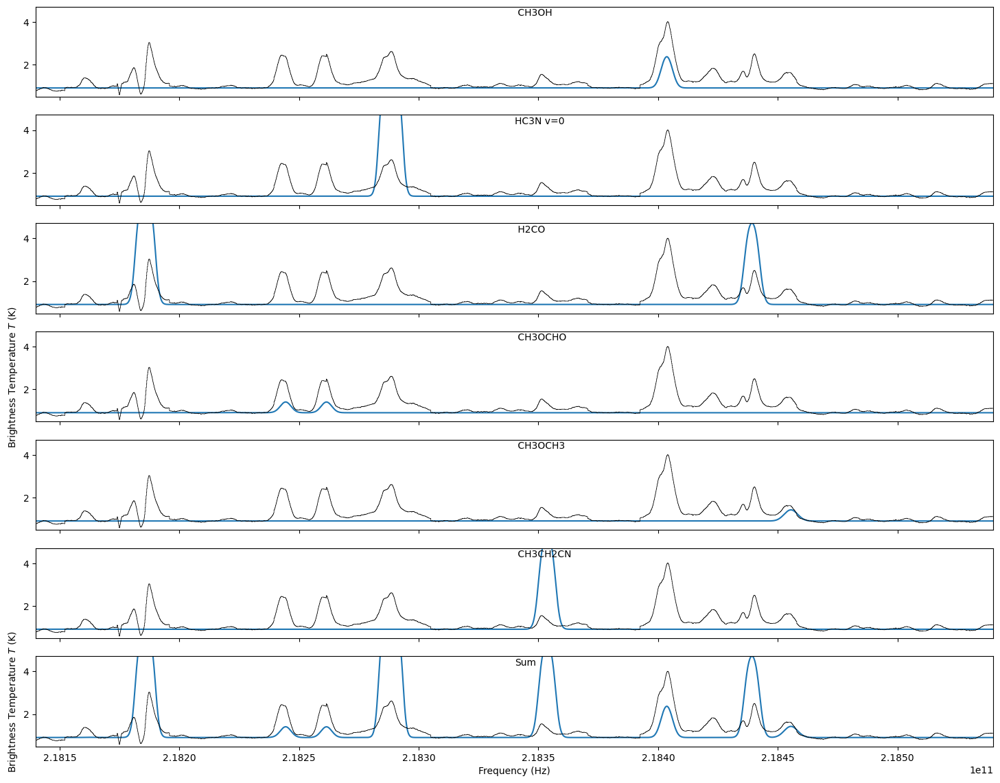

LTE Line Model example: Line identification
===========================================

.. include:: <isogrk3.txt>

.. include:: example_LTE_lineforest.py
   :literal:

    W51 spectrum with LTE lines at T_X = 100, N=10^17
