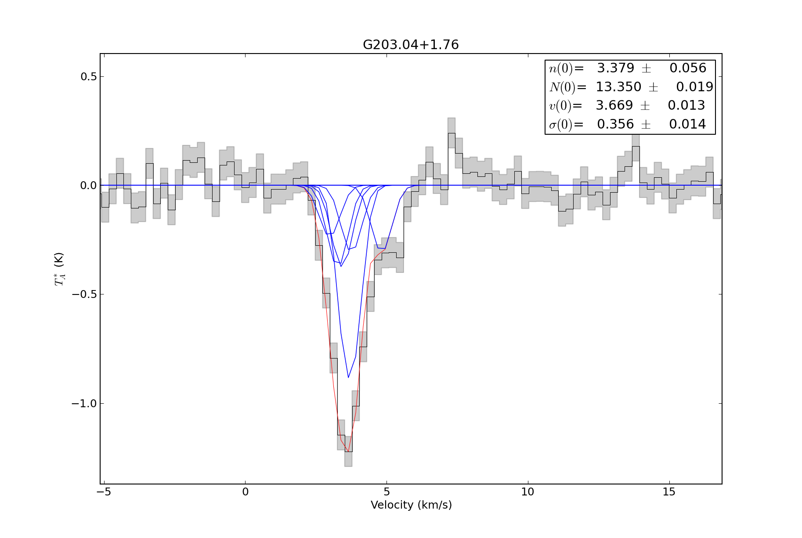
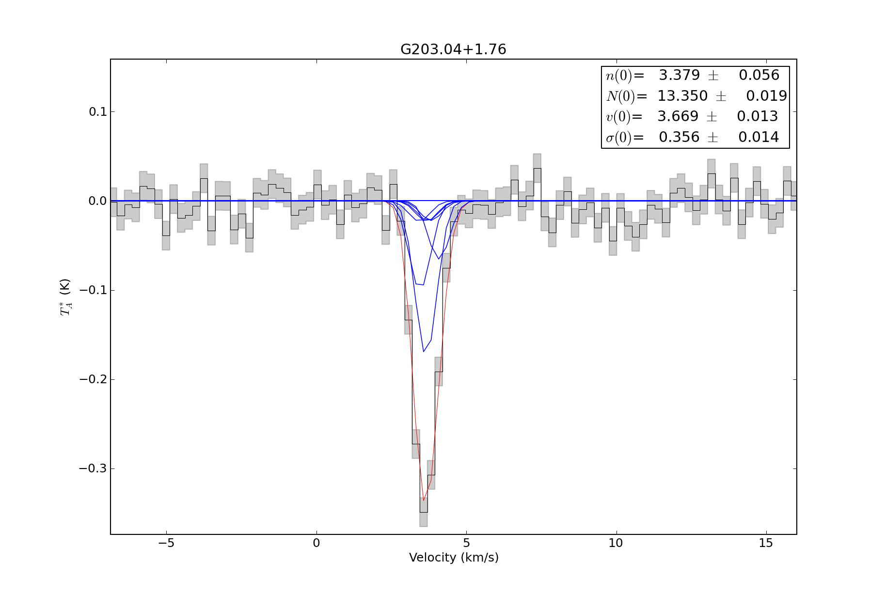

.. include:: <isogrk3.txt>

Radio Fitting: H\ :sub:`2`\ CO RADEX example
~~~~~~~~~~~~~~~~~~~~~~~~~~~~~~~~~~~~~~~~~~~~
Because an LVG model grid is being used as the basis for the fitting in this example, there are fewer free parameters.  
If you want to create your own model grid, there is a set of tools for creating RADEX model grids (in parallel) at 
`the agpy RADEX page  <https://github.com/keflavich/agpy/tree/master/radex>`_.  The model grids used below
are available on the `pyspeckit bitbucket download page <https://bitbucket.org/pyspeckit/pyspeckit.bitbucket.org/downloads>`_.

::

    import pyspeckit
    import numpy as np
    import astropy.io.fits as pyfits
    from pyspeckit.spectrum import models

    # create the Formaldehyde Radex fitter
    # This step cannot be easily generalized: the user needs to read in their own grids
    texgrid1 = pyfits.getdata('/Users/adam/work/h2co/radex/grid_greenscaled/1-1_2-2_T5to55_lvg_greenscaled_tex1.fits')
    taugrid1 = pyfits.getdata('/Users/adam/work/h2co/radex/grid_greenscaled/1-1_2-2_T5to55_lvg_greenscaled_tau1.fits')
    texgrid2 = pyfits.getdata('/Users/adam/work/h2co/radex/grid_greenscaled/1-1_2-2_T5to55_lvg_greenscaled_tex2.fits')
    taugrid2 = pyfits.getdata('/Users/adam/work/h2co/radex/grid_greenscaled/1-1_2-2_T5to55_lvg_greenscaled_tau2.fits')
    hdr = pyfits.getheader('/Users/adam/work/h2co/radex/grid_greenscaled/1-1_2-2_T5to55_lvg_greenscaled_tau2.fits')

    # this deserves a lot of explanation:
    # models.formaldehyde.formaldehyde_radex is the MODEL that we are going to fit
    # models.model.SpectralModel is a wrapper to deal with parinfo, multiple peaks,
    # and annotations
    # all of the parameters after the first are passed to the model function 
    formaldehyde_radex_fitter = models.model.SpectralModel(
            models.formaldehyde.formaldehyde_radex, 4,
            parnames=['density','column','center','width'], 
            parvalues=[4,12,0,1],
            parlimited=[(True,True), (True,True), (False,False), (True,False)], 
            parlimits=[(1,8), (11,16), (0,0), (0,0)],
            parsteps=[0.01,0.01,0,0],
            fitunits='Hz',
            texgrid=((4,5,texgrid1),(14,15,texgrid2)), # specify the frequency range over which the grid is valid (in GHz)
            taugrid=((4,5,taugrid1),(14,15,taugrid2)),
            hdr=hdr,
            shortvarnames=("n","N","v","\\sigma"), # specify the parameter names (TeX is OK)
            grid_vwidth_scale=False,
            )

    # sphere version:
    texgrid1 = pyfits.getdata('/Users/adam/work/h2co/radex/grid_aug2011_sphere/grid_aug2011_sphere_tex1.fits')
    taugrid1 = pyfits.getdata('/Users/adam/work/h2co/radex/grid_aug2011_sphere/grid_aug2011_sphere_tau1.fits')
    texgrid2 = pyfits.getdata('/Users/adam/work/h2co/radex/grid_aug2011_sphere/grid_aug2011_sphere_tex2.fits')
    taugrid2 = pyfits.getdata('/Users/adam/work/h2co/radex/grid_aug2011_sphere/grid_aug2011_sphere_tau2.fits')
    hdr = pyfits.getheader('/Users/adam/work/h2co/radex/grid_aug2011_sphere/grid_aug2011_sphere_tau2.fits')

    formaldehyde_radex_fitter_sphere = models.model.SpectralModel(
            models.formaldehyde.formaldehyde_radex, 4,
            parnames=['density','column','center','width'], 
            parvalues=[4,12,0,1],
            parlimited=[(True,True), (True,True), (False,False), (True,False)], 
            parlimits=[(1,8), (11,16), (0,0), (0,0)],
            parsteps=[0.01,0.01,0,0],
            fitunits='Hz',
            texgrid=((4,5,texgrid1),(14,15,texgrid2)),
            taugrid=((4,5,taugrid1),(14,15,taugrid2)),
            hdr=hdr,
            shortvarnames=("n","N","v","\\sigma"),
            grid_vwidth_scale=True,
            )

    sp1 = pyspeckit.Spectrum('G203.04+1.76_h2co.fits',wcstype='D',scale_keyword='ETAMB')
    sp2 = pyspeckit.Spectrum('G203.04+1.76_h2co_Tastar.fits',wcstype='V',scale_keyword='ETAMB')

    sp1.crop(-50,50)
    sp1.smooth(3) # match to GBT resolution
    sp2.crop(-50,50)

    sp1.xarr.convert_to_unit('GHz')
    sp1.specfit() # determine errors
    sp1.error = np.ones(sp1.data.shape)*sp1.specfit.residuals.std()
    sp1.baseline(excludefit=True)
    sp2.xarr.convert_to_unit('GHz')
    sp2.specfit() # determine errors
    sp2.error = np.ones(sp2.data.shape)*sp2.specfit.residuals.std()
    sp2.baseline(excludefit=True)
    sp = pyspeckit.Spectra([sp1,sp2])

    sp.Registry.add_fitter('formaldehyde_radex',
            formaldehyde_radex_fitter,4)
    sp.Registry.add_fitter('formaldehyde_radex_sphere',
            formaldehyde_radex_fitter_sphere,4)

    sp.plotter()
    sp.specfit(fittype='formaldehyde_radex',multifit=None,guesses=[4,12,3.75,0.43],quiet=False)

    # these are just for pretty plotting:
    sp1.specfit.fitter = sp.specfit.fitter
    sp1.specfit.modelpars = sp.specfit.modelpars
    sp1.specfit.model = np.interp(sp1.xarr,sp.xarr,sp.specfit.model)
    sp2.specfit.fitter = sp.specfit.fitter
    sp2.specfit.modelpars = sp.specfit.modelpars
    sp2.specfit.model = np.interp(sp2.xarr,sp.xarr,sp.specfit.model)

    # previously, xarrs were in GHz to match the fitting scheme
    sp1.xarr.convert_to_unit('km/s')
    sp2.xarr.convert_to_unit('km/s')

    sp1.plotter(xmin=-5,xmax=15,errstyle='fill')
    sp1.specfit.plot_fit(show_components=True)
    sp2.plotter(xmin=-5,xmax=15,errstyle='fill')
    sp2.specfit.plot_fit(show_components=True)

    sp.plotter(figure=5)
    sp.specfit(fittype='formaldehyde_radex_sphere',multifit=None,guesses=[4,13,3.75,0.43],quiet=False)

    # these are just for pretty plotting:
    sp1.specfit.fitter = sp.specfit.fitter
    sp1.specfit.modelpars = sp.specfit.modelpars
    sp1.specfit.model = np.interp(sp1.xarr.as_unit('GHz'),sp.xarr,sp.specfit.model)
    sp2.specfit.fitter = sp.specfit.fitter
    sp2.specfit.modelpars = sp.specfit.modelpars
    sp2.specfit.model = np.interp(sp2.xarr.as_unit('GHz'),sp.xarr,sp.specfit.model)

    sp1.plotter(xmin=-5,xmax=15,errstyle='fill',figure=6)
    sp1.specfit.plot_fit(show_components=True)
    sp2.plotter(xmin=-5,xmax=15,errstyle='fill',figure=7)
    sp2.specfit.plot_fit(show_components=True)

        Both transitions are fit simultaneously using a RADEX model.  The input (fitted) parameters are therefore density, column density, width, and velocity.

