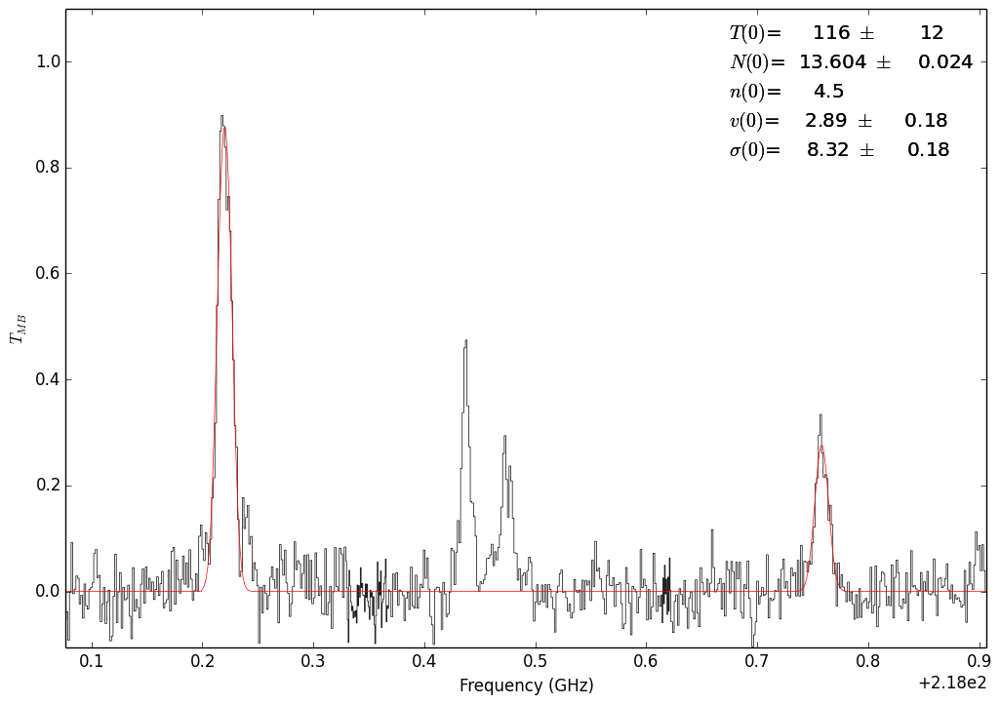
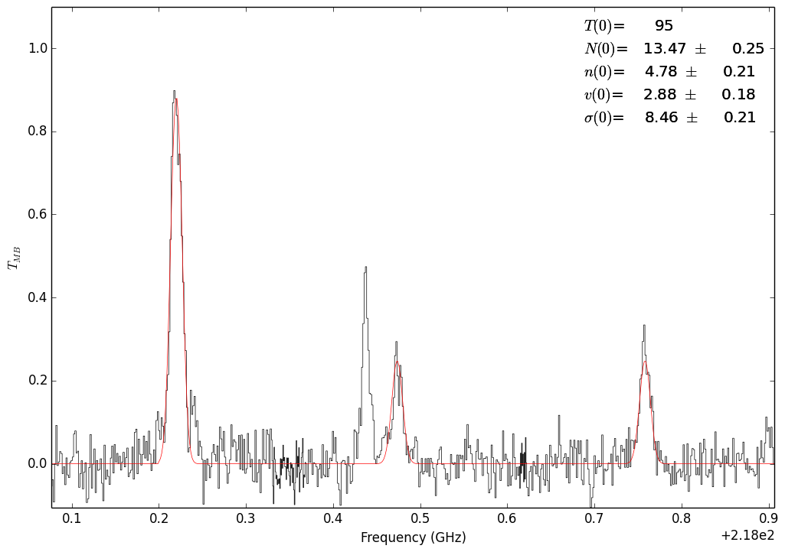
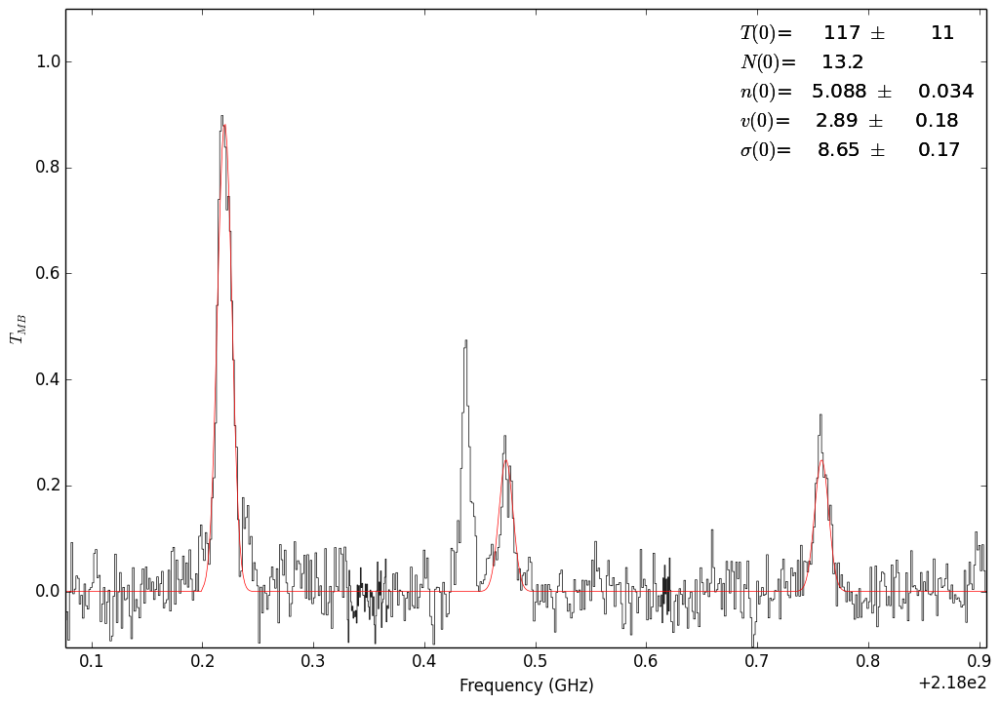
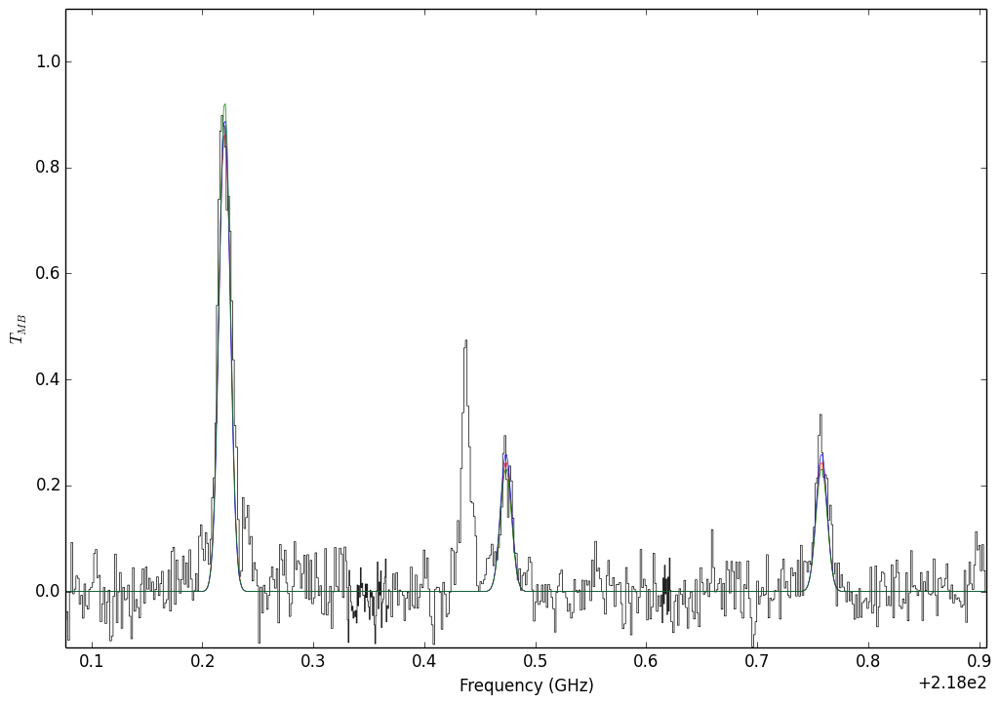

.. include:: <isogrk3.txt>

Radio Fitting: |H2CO| millimeter thermometer lines
===========================================================

Example hyperfine line fitting of a data cube for the |H2CO| 303-202, 321-220,
and 322-221 lines.

.. literalinclude:: ../examples/h2co_mm_example.py
    :language: python

    Fit with the 302-202 and 321-220 lines

.. figure:: images/h2co_mm_fit_303-202_322-221.png
    :figwidth: 800
    :width: 800

    Fit with the 302-202 and 321-220 lines

    Fit with all 3 lines.  In this case, the temperature is unconstrained.

    Fit with all 3 lines.  In this case, the column is unconstrained.

    A demonstration of degenerate parameters.  The parameters used are:

     * Blue:  T,N,n =  95, 13.5,  4.75
     * Green: T,N,n = 165, 13.5,  7.0
     * Red:   T,N,n = 117, 13.15, 5.25

.. |H2CO| replace:: H\ :sub:`2`\ CO
