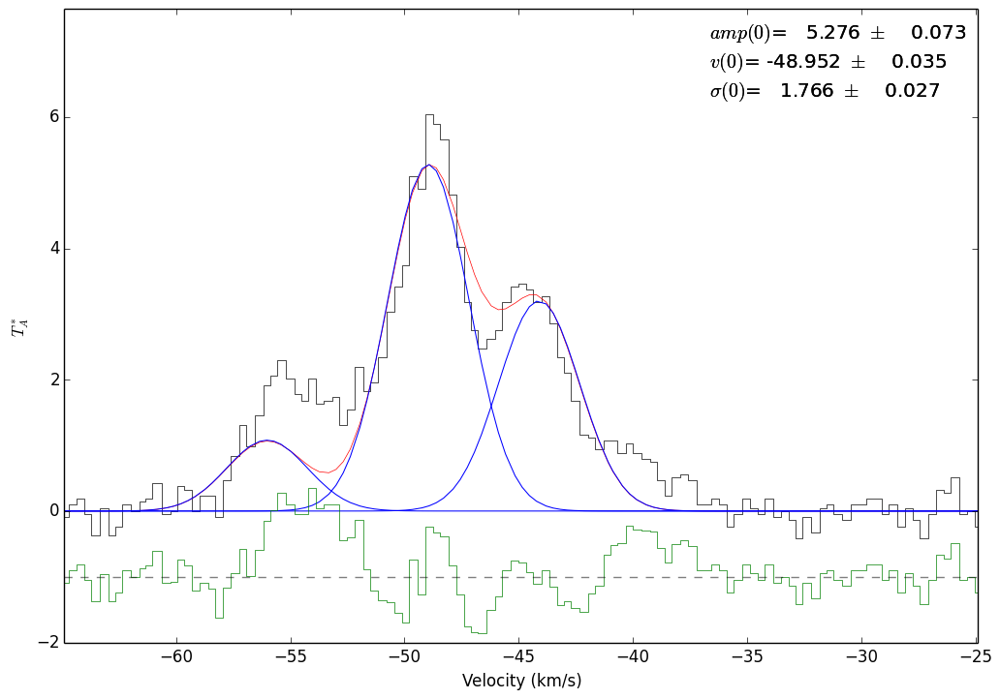
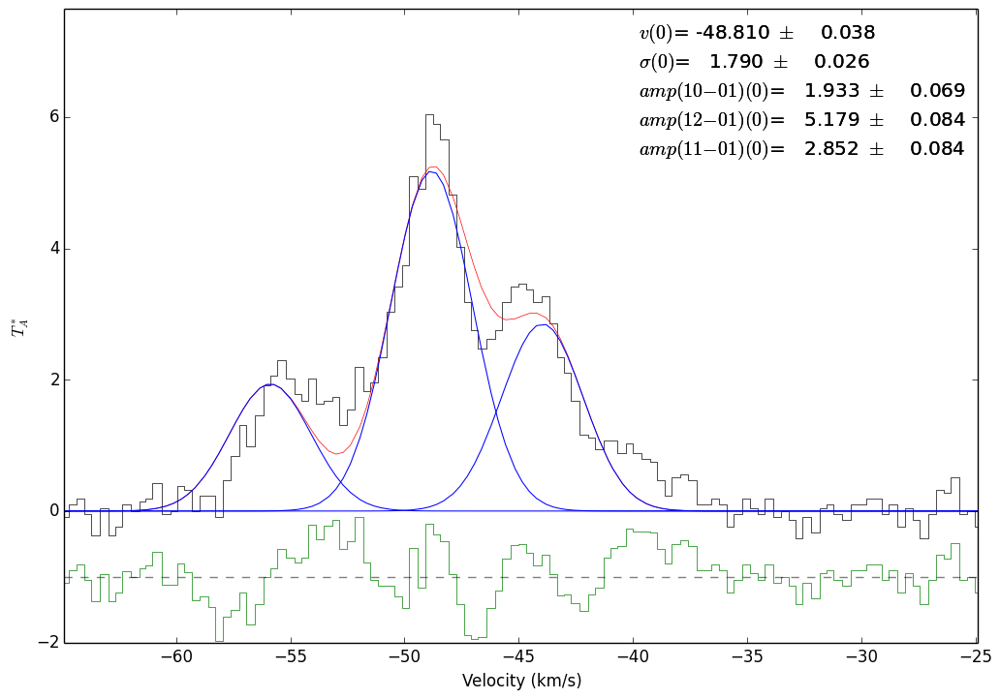
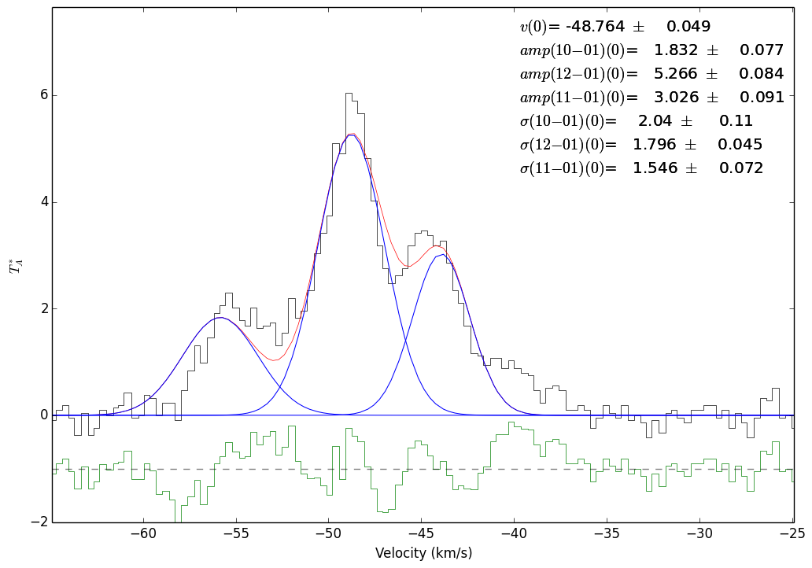
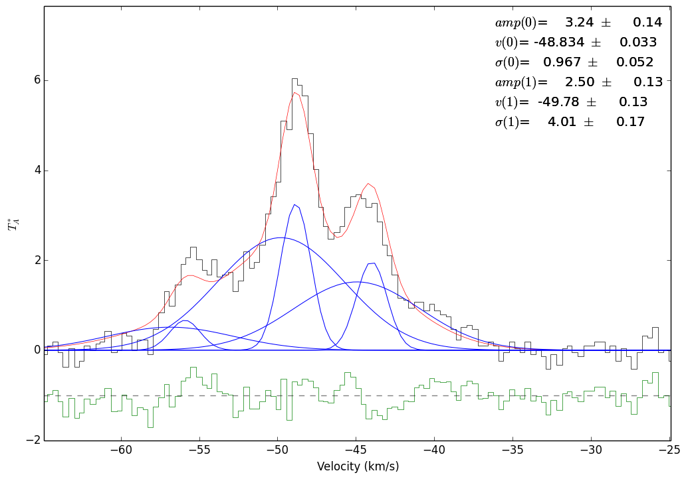

Radio Fitting: HCN example with freely varying hyperfine amplitudes
===================================================================

.. include:: <isogrk3.txt>

Example hyperfine line fitting for the HCN 1-0 line.

.. literalinclude:: ../examples/hcn_example.py
   :language: python

The green lines in the following figures all show the residuals to the fit              

        Fit to the 3 hyperfine components of HCN 1-0 simultaneously with fixed amplitudes.  The (0)'s indicate that this is the 0'th velocity component being fit (though that velocity corresponds to the 12-01 component of the line)

        Fit to the 3 hyperfine components of HCN 1-0 simultaneously with freely varying amplitudes.  The (0)'s indicate that this is the 0'th velocity component being fit

        Fit to the 3 hyperfine components of HCN 1-0 simultaneously.  The widths are allowed to vary in this example.

        A two-component fit to the same spectrum.  It appears to be a much
        better fit, hinting that there are indeed two components (though the
        fit is probably not unique)
