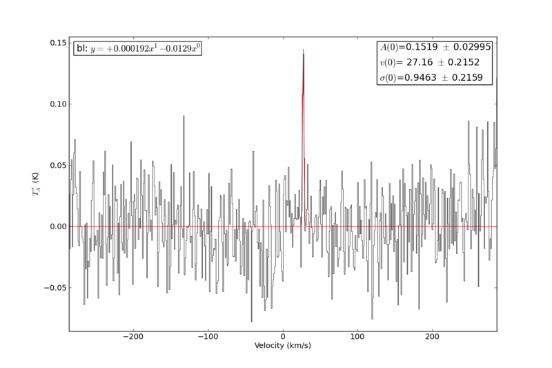
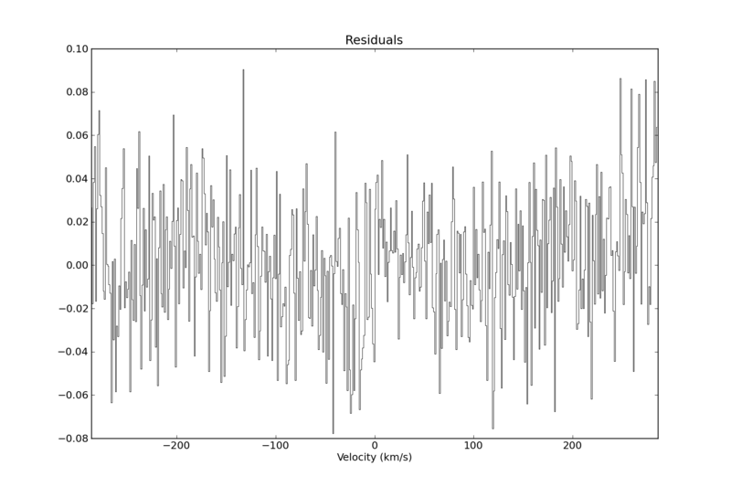
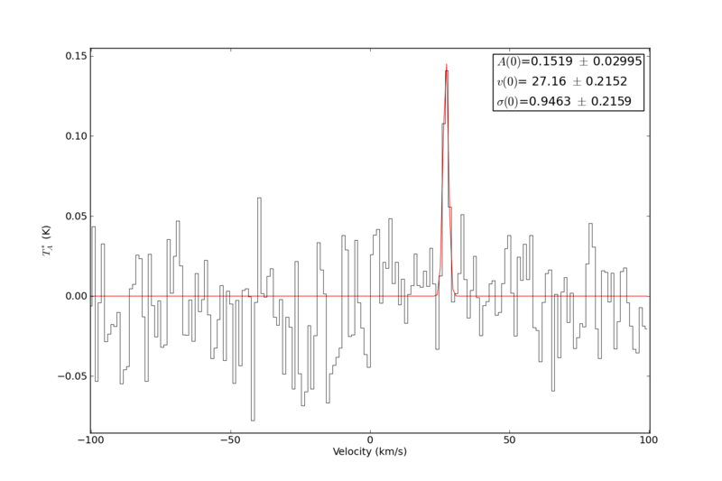

Simple Radio Fitting: HCO+ example
==================================

.. include:: <isogrk3.txt>

.. include:: example_hcop.py
   :literal:

    Sample HCO+ spectrum fitted with a gaussian

    Residuals of the gaussian fit from the previous figure

    A zoomed-in, cropped version of the spectrum.  With the 'crop' command, the excess data is discarded.
