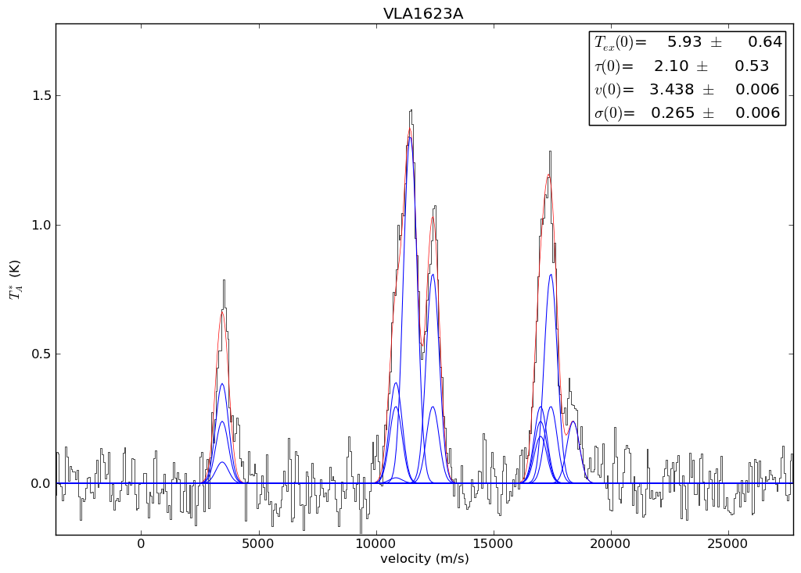

.. include:: <isogrk3.txt>

Radio Fitting: N\ :sub:`2`\ H+ example
============================================
Example hyperfine line fitting for the N\ :sub:`2`\ H+ 1-0 line.

.. literalinclude:: ../examples/n2hp_example.py
    :language: python

