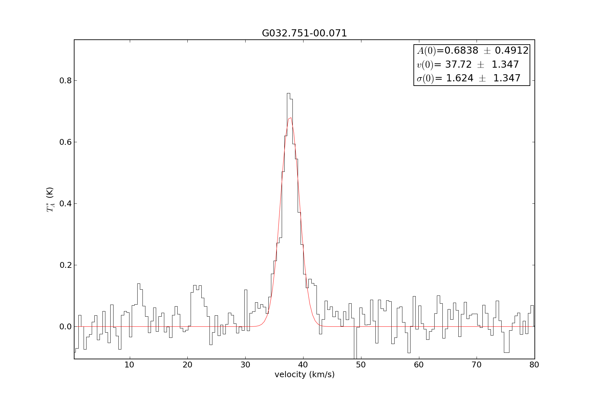
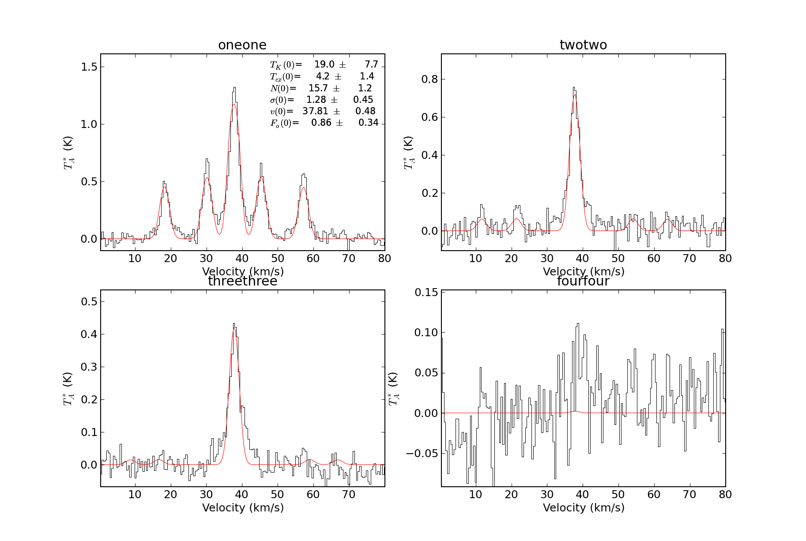

Radio Fitting: NH\ :sub:`3` example
~~~~~~~~~~~~~~~~~~~~~~~~~~~~~~~~~~~~~

.. include:: <isogrk3.txt>

::

    import pyspeckit

    # The ammonia fitting wrapper requires a dictionary specifying the transition name
    # (one of the four specified below) and the filename.  Alternately, you can have the
    # dictionary values be pre-loaded Spectrum instances
    filenames = {'oneone':'G032.751-00.071_nh3_11_Tastar.fits',
        'twotwo':'G032.751-00.071_nh3_22_Tastar.fits',
        'threethree':'G032.751-00.071_nh3_33_Tastar.fits',
        'fourfour':'G032.751-00.071_nh3_44_Tastar.fits'}

    # Fit the ammonia spectrum with some reasonable initial guesses.  It is
    # important to crop out extraneous junk and to smooth the data to make the
    # fit proceed at a reasonable pace.  
    spdict1,spectra1 = pyspeckit.wrappers.fitnh3.fitnh3tkin(filenames,crop=[0,80],tkin=18.65,tex=4.49,column=15.5,fortho=0.9,verbose=False,smooth=6)

    The 2-2 transition is used to guess the central velocity and width via gaussian fitting because its hyperfine lines are weaker

    Then all 4 lines are simultaneously fit.  Even upper limits on the 4-4 line can provide helpful constraints on the model

