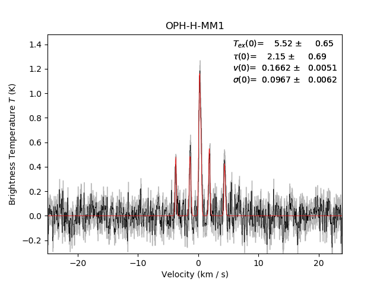

.. include:: <isogrk3.txt>

Radio Fitting: para-NH\ :sub:`2`\ D example
===========================================
Example hyperfine line fitting for the para-NH\ :sub:`2`\ D line.

.. literalinclude:: ../examples/example_pNH2D.py
    :language: python

