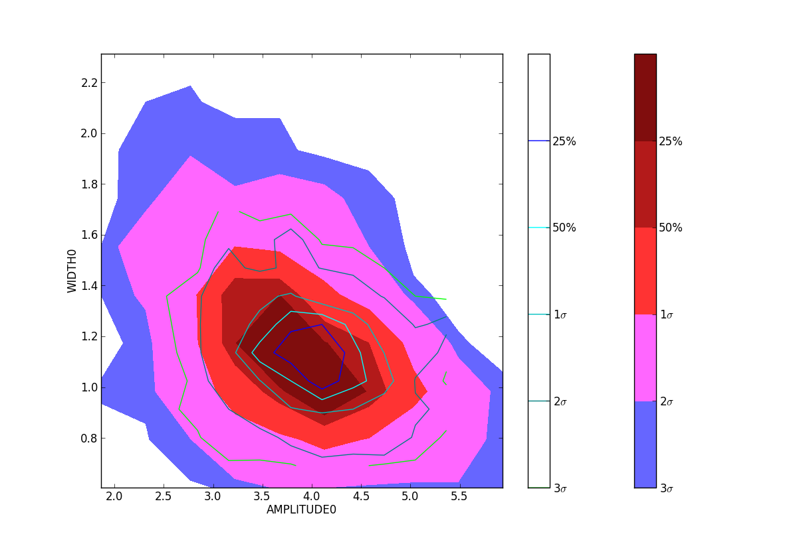
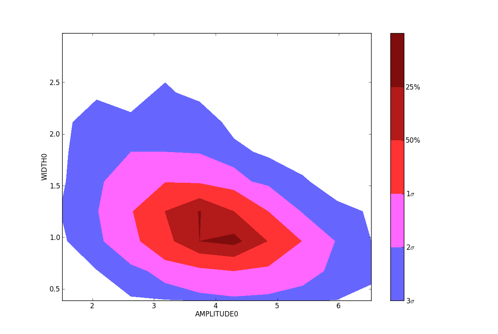

.. include:: <isogrk3.txt>

Monte Carlo examples
~~~~~~~~~~~~~~~~~~~~
There are (at least) two packages implementing Monte Carlo sampling available
in python: `pymc <https://github.com/pymc-devs/pymc>`_ and `emcee
<https://emcee.readthedocs.io/en/stable/>`_.  `pyspeckit` includes interfaces to both.  With
the pymc interface, it is possible to define priors that strictly limit the
parameter space.  So far that is not possible with emcee.

The examples below use a custom plotting package from `agpy
<https://github.com/keflavich/agpy/>`_.  It is a relatively simple but convenient
wrapper around numpy's histogram2d.  `pymc_plotting
<https://github.com/keflavich/agpy/blob/master/agpy/pymc_plotting.py>`_
takes care of indexing, percentile determination, and coloring.

The example below shows the results of a gaussian fit to noisy data (S/N ~ 6).
The parameter space is then explored with `pymc` and `emcee` in order to examine
the correlation between width and amplitude.

.. literalinclude:: ../examples/example_pymc.py
    :language: python

        (marginalized over X-offset and Y-offset) with and without priors; with
        priors is shown in contour lines
    :figwidth: 800
    :width: 800

The Amplitude-Width parameter space sampled by pymc with (lines) and without
(solid) priors.  There is moderate anticorrelation between the line width and
the peak amplitude.  The + symbol indicates the input parameters; the model does
a somewhat poor job of recovering the true values (in case you're curious, there is
no intrinsic bias - if you repeat the above fitting procedure a few hundred times, the
mean fitted amplitude is 5.0).

The parameter space sampled with `emcee` and binned onto a 25x25 grid.  Note
that `emcee` has 6x as many points (and takes about 6x as long to run) because
there are 6 "walkers" for the 3 parameters being fit.

