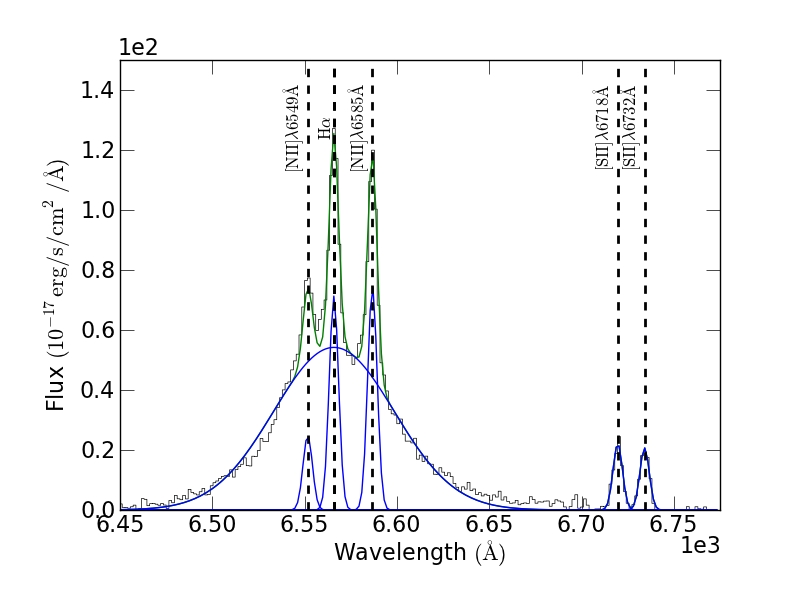

Optical fitting: The H\ |alpha|\ -[NII] complex of a type-I Seyfert galaxy
~~~~~~~~~~~~~~~~~~~~~~~~~~~~~~~~~~~~~~~~~~~~~~~~~~~~~~~~~~~~~~~~~~~~~~~~~~
.. include:: <isogrk3.txt>

.. include:: example_sdss.py
   :literal:

