.. include:: <isogrk3.txt>

Optical Plotting - Echelle spectrum of Vega (in color!)
~~~~~~~~~~~~~~~~~~~~~~~~~~~~~~~~~~~~~~~~~~~~~~~~~~~~~~~

.. import:: example_vega_echelle.py
   :literal:

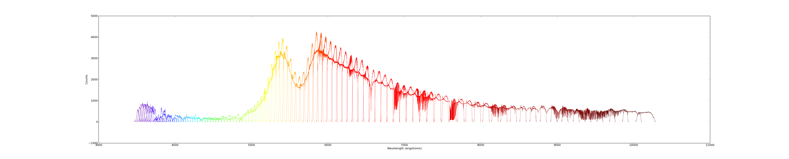
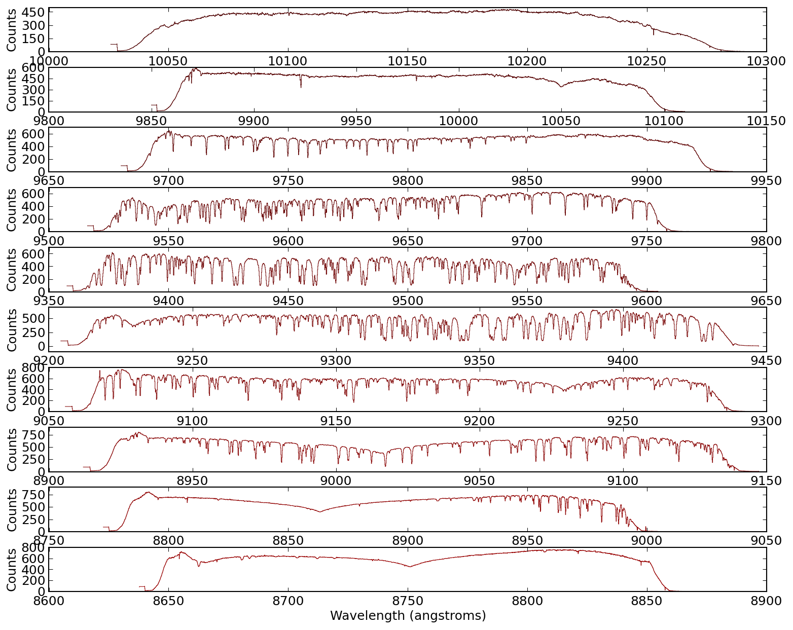
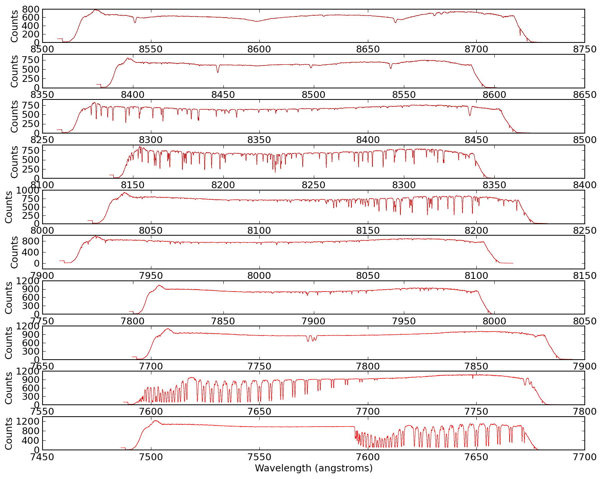
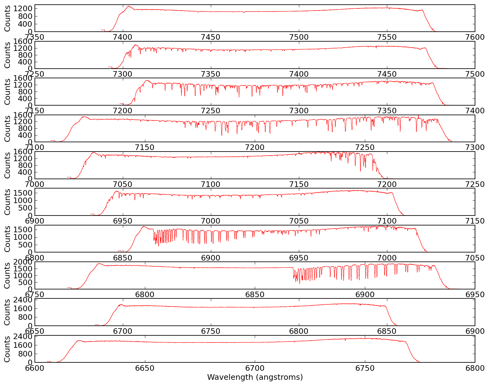
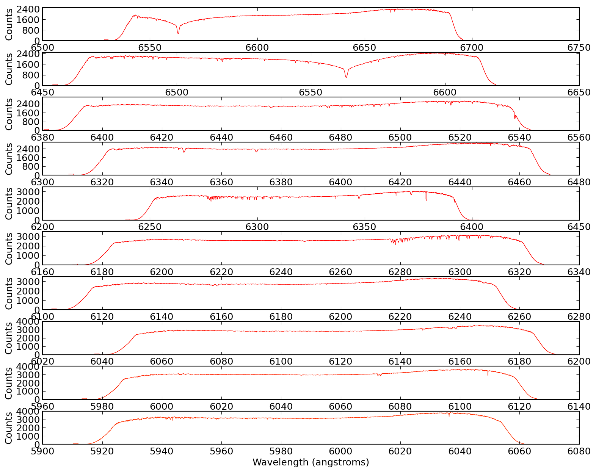
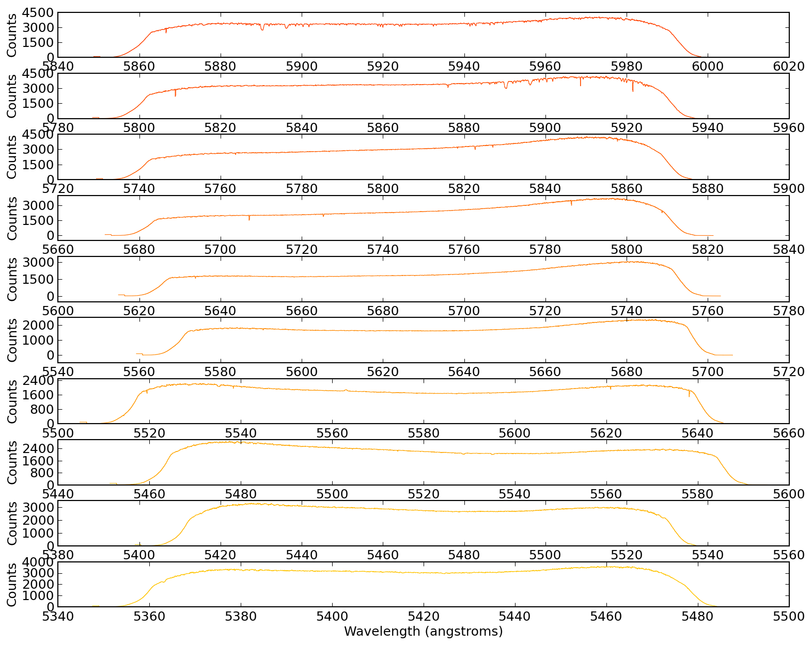
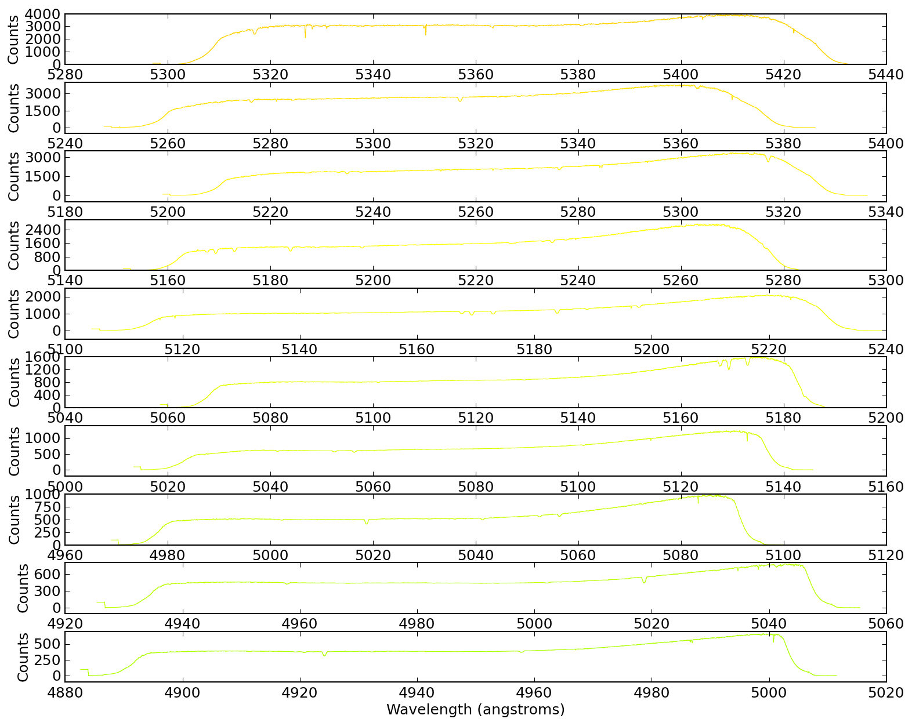
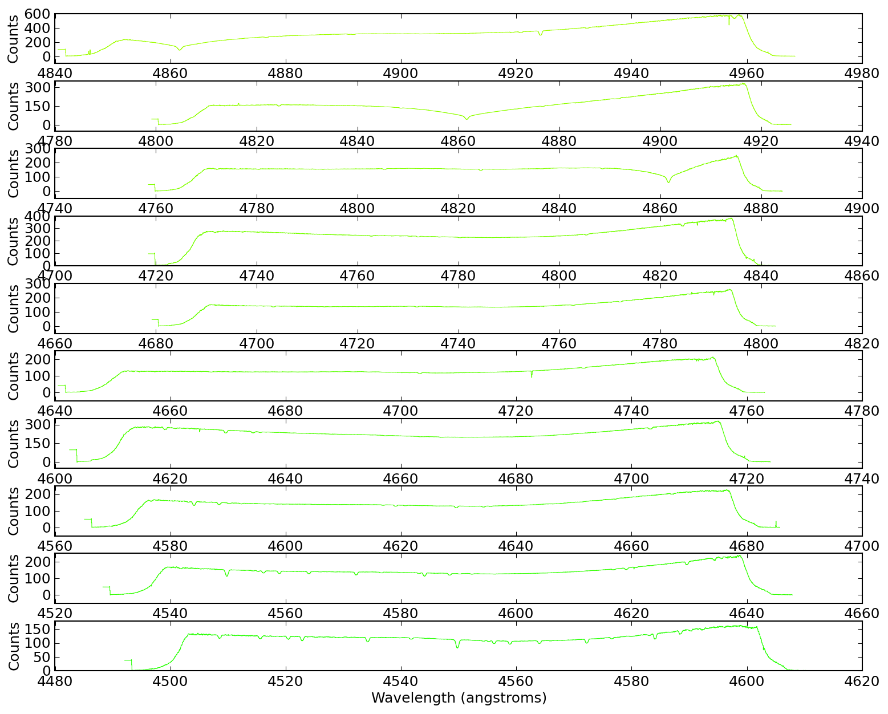
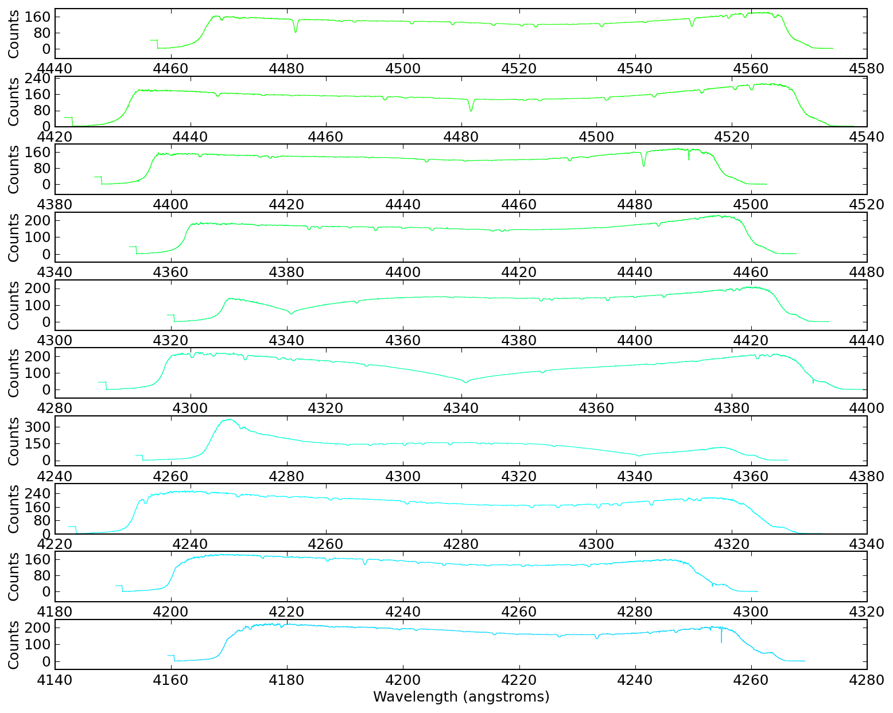
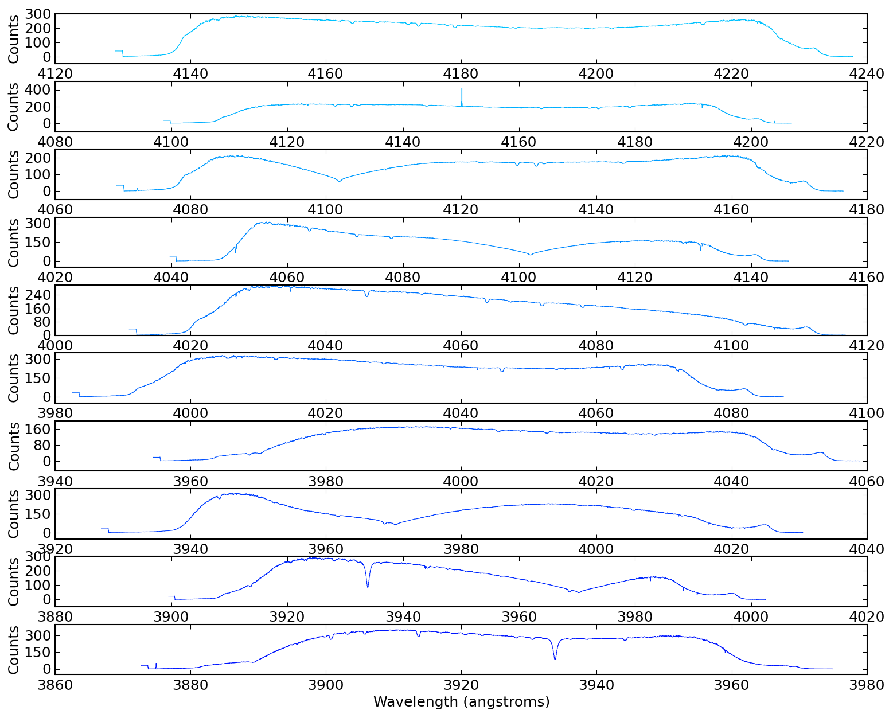
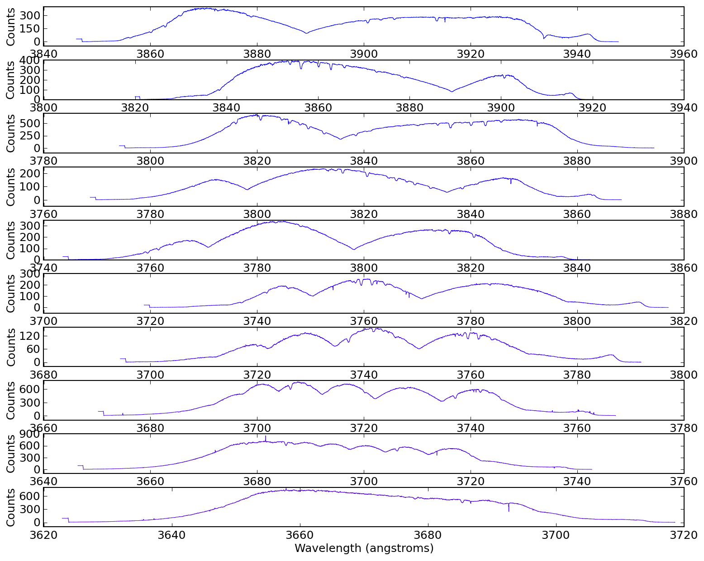
