.. include:: <isogrk3.txt>

Optical Plotting - Echelle spectrum of Vega (in color!)
~~~~~~~~~~~~~~~~~~~~~~~~~~~~~~~~~~~~~~~~~~~~~~~~~~~~~~~

.. include:: example_vega_echelle.py
   :literal:

Modifying and saving echelle orders
-----------------------------------

`~pyspeckit.wrappers.load_IRAF_multispec.load_IRAF_multispec` returns a
list of `~pyspeckit.spectrum.classes.Spectrum` objects, one per echelle
order.  There is no writer for the IRAF multispec format itself, but each
order can be modified and written out as a standard (linear-wavelength)
1D FITS spectrum with `Spectrum.write`::

    import pyspeckit

    orders = pyspeckit.wrappers.load_IRAF_multispec('evega.0039.rs.ec.dispcor.fits')

    # modify the flux of each order however you like, e.g.:
    for sp in orders:
        sp.data = sp.data * 2

    # save each order to its own FITS file
    for ii, sp in enumerate(orders):
        sp.write('vega_order{0:03d}.fits'.format(ii), type='fits')

    # the saved files are standard 1D spectra; they can be re-loaded with
    sp10 = pyspeckit.Spectrum('vega_order010.fits')

By default the error spectrum is written as a second row in the output
file; pass ``errspecnum=1`` to `pyspeckit.Spectrum` to recover it when
re-loading, or ``write_error=False`` to `Spectrum.write` to write only
the flux.

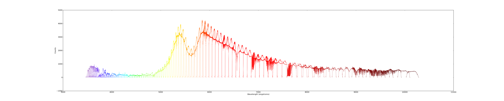
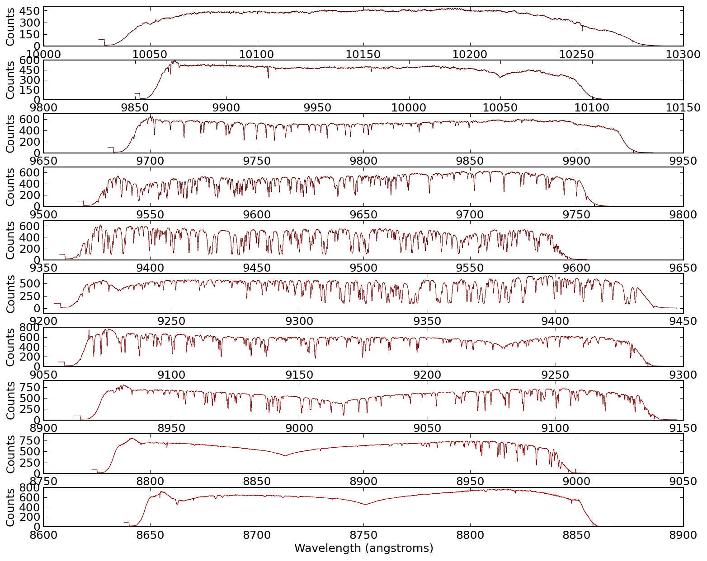
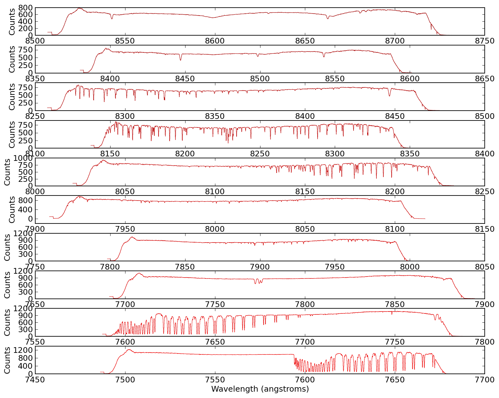
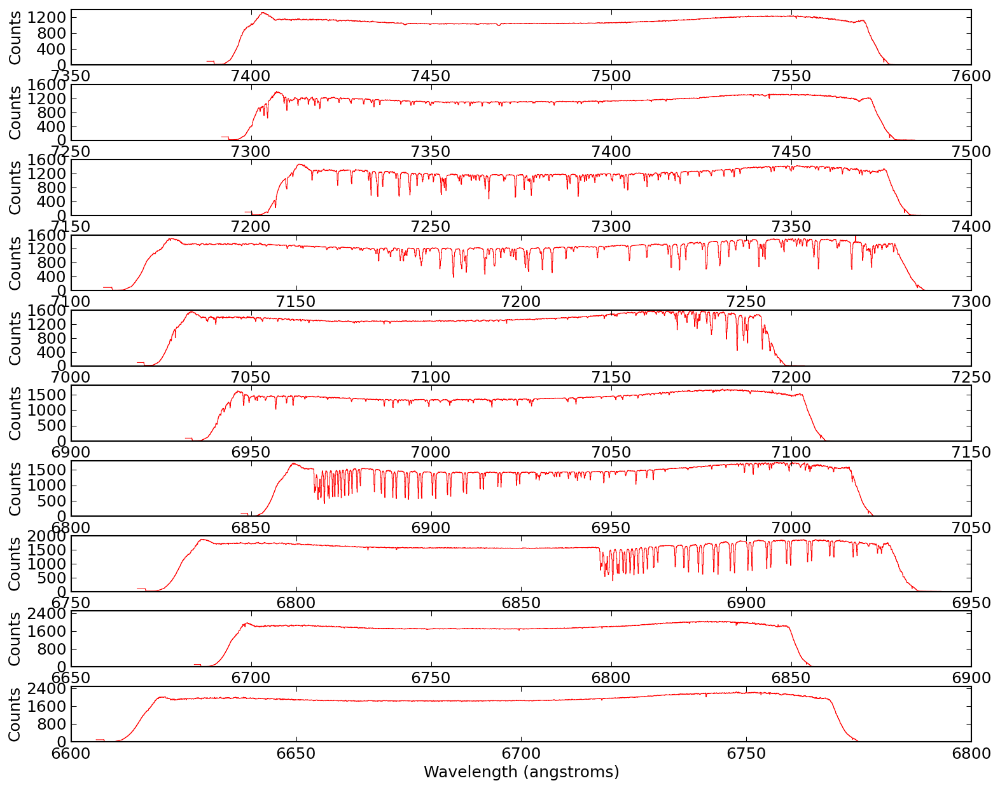
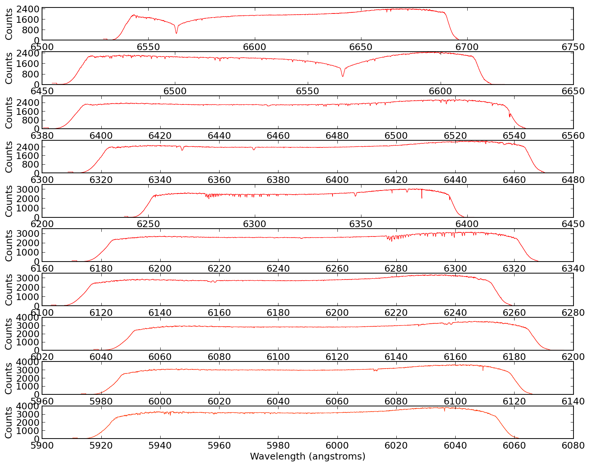
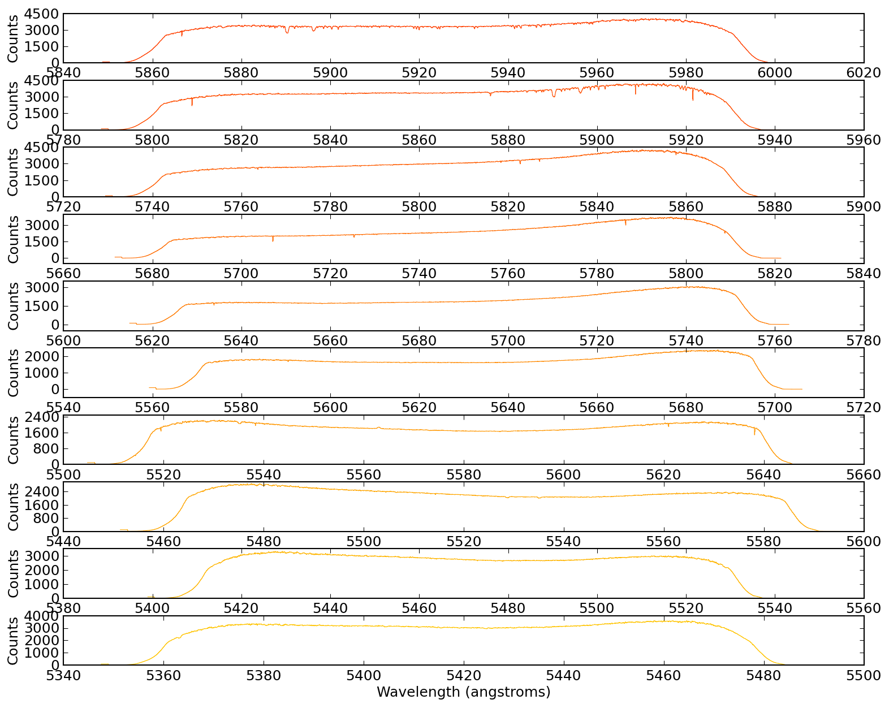
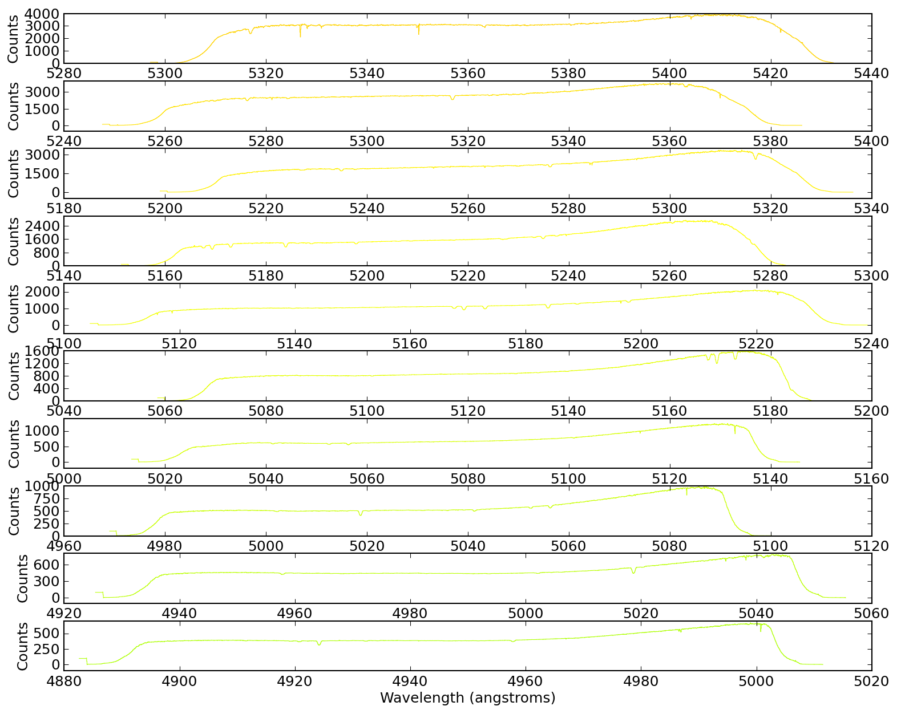
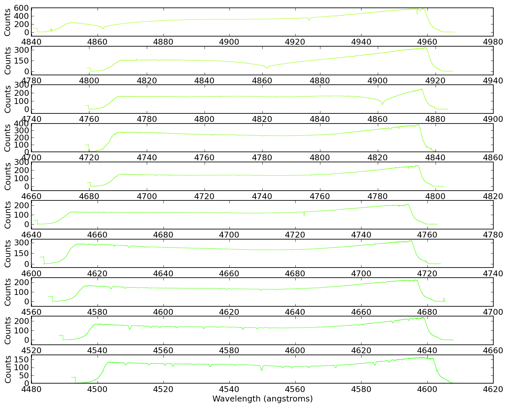
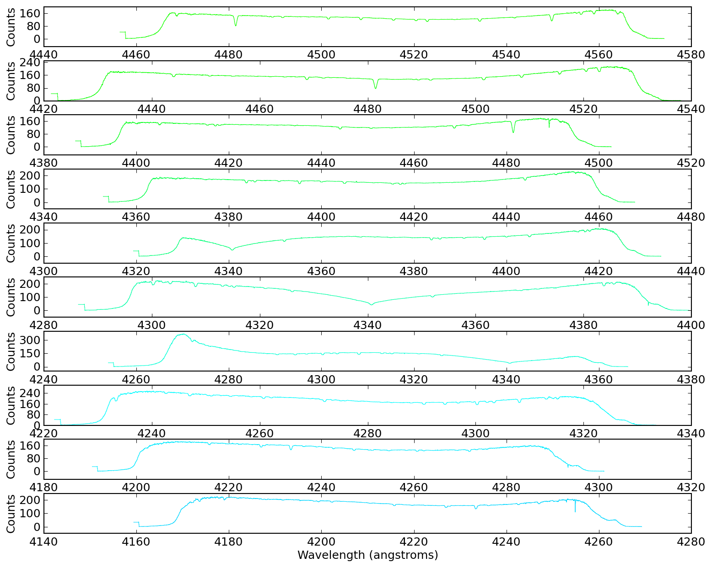
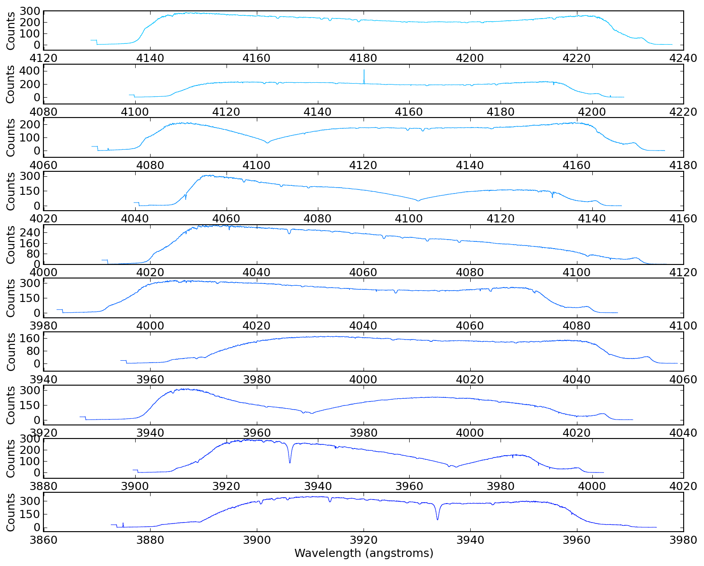
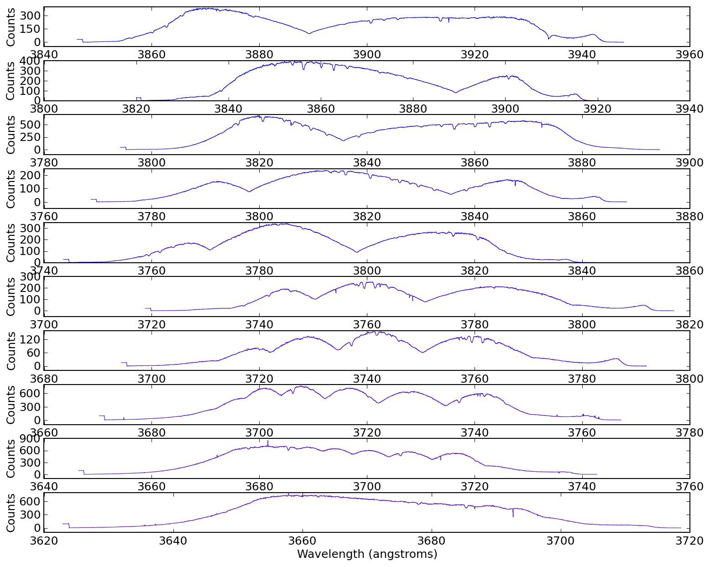
