A guide to interactive fitting
==============================

A step-by-step example of how to use the interactive fitter.

In short, we will do the following:

.. code-block:: python

    # 1. Load the spectrum
    sp = pyspeckit.Spectrum('hr2421.fit')

    # 2. Plot a particular spectral line
    sp.plotter(xmin=4700,xmax=5000)

    # 3. Need to fit the continuum first
    sp.baseline(interactive=True, subtract=False)

    # 4... (much work takes place interactively at this stage)

    # 5. Start up an interactive line-fitting session
    sp.specfit(interactive=True)

.. note:: 

    If you don't see a plot window after step #2 above, make sure you're using
    matplotlib in interactive mode.  This may require starting ipython as
    ``ipython --pylab``

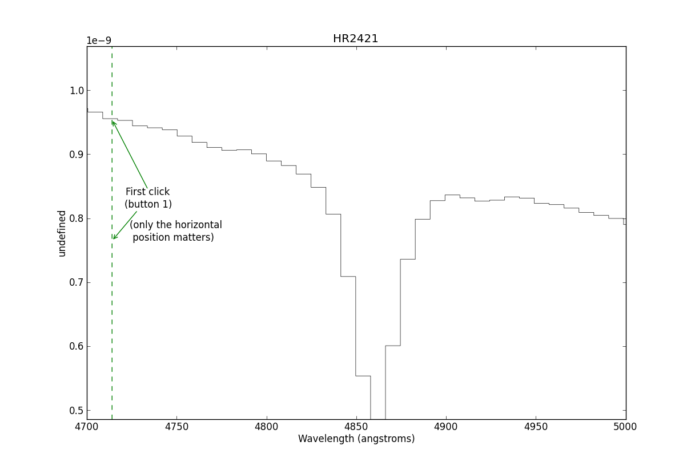

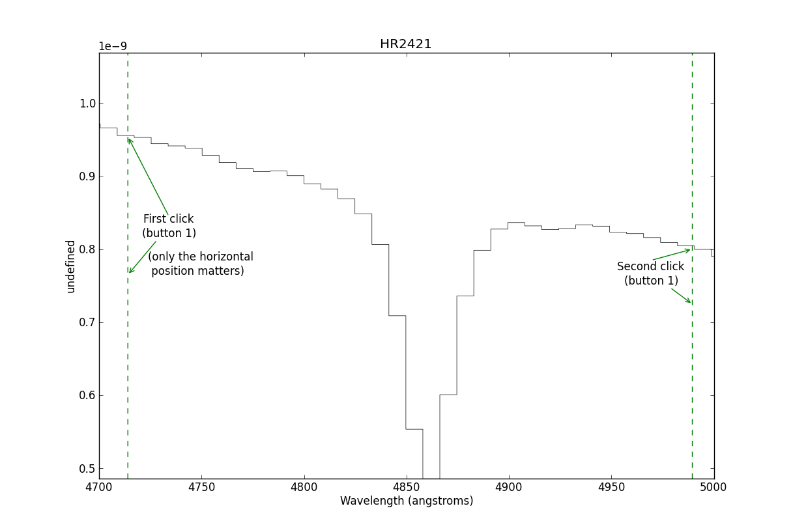

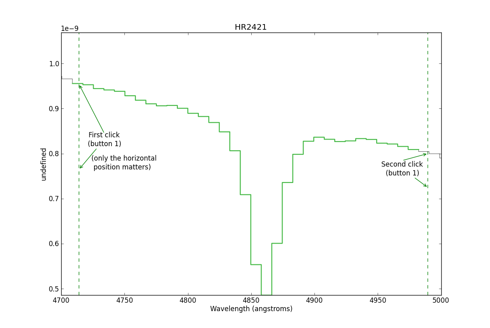

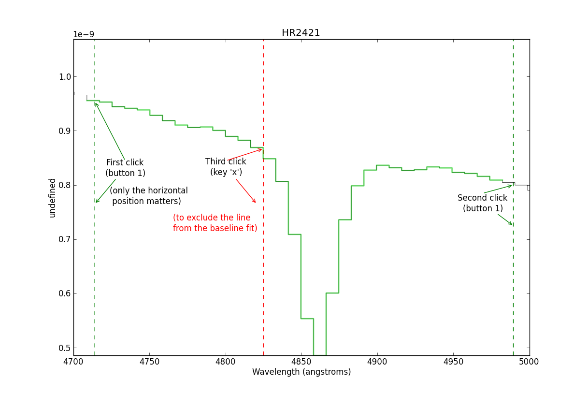

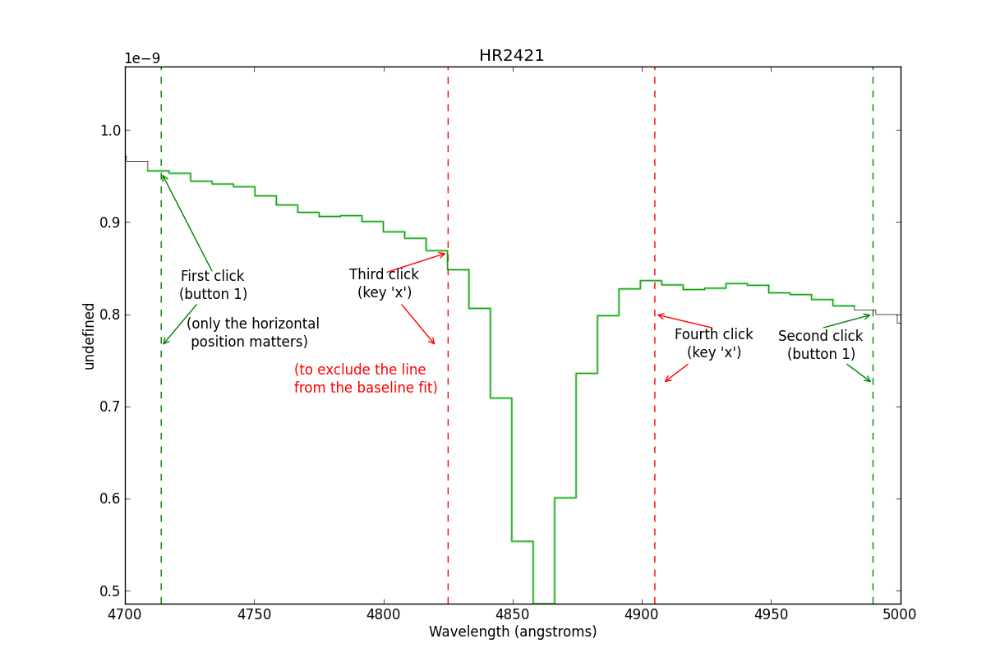

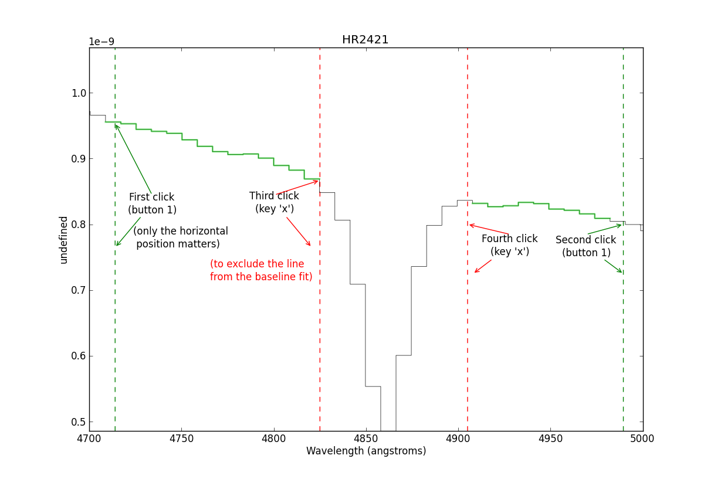

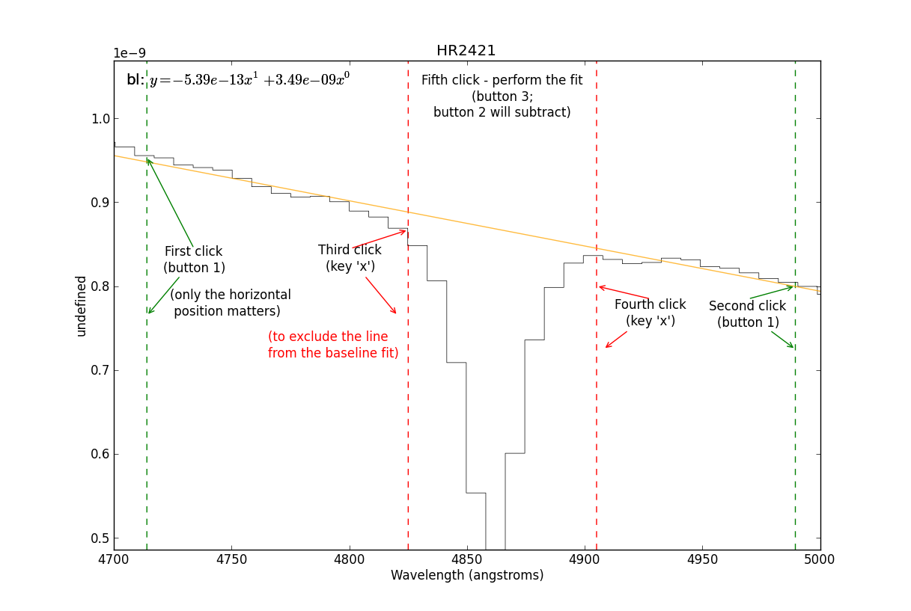

This is where you start the line-fitter:

.. code-block:: python

    # Start up an interactive line-fitting session
    sp.specfit(interactive=True)

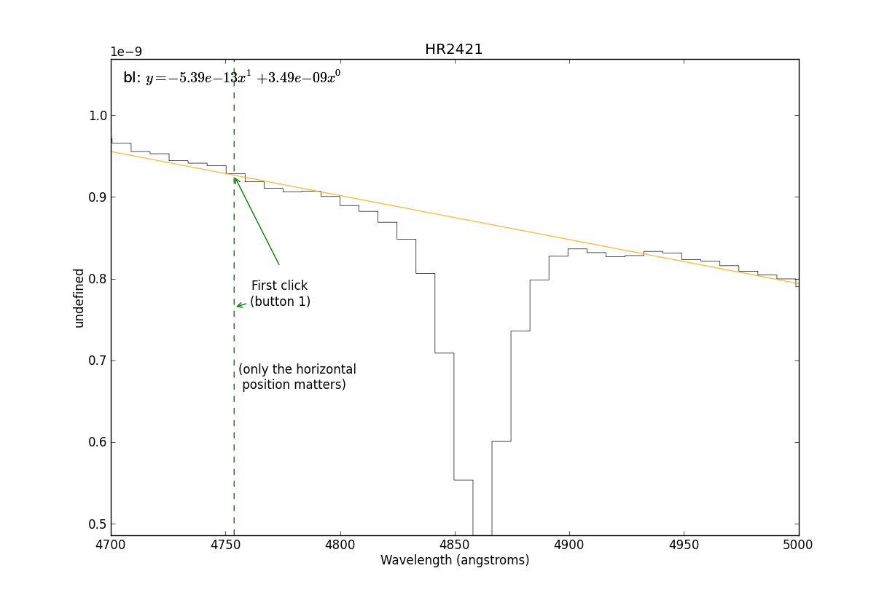

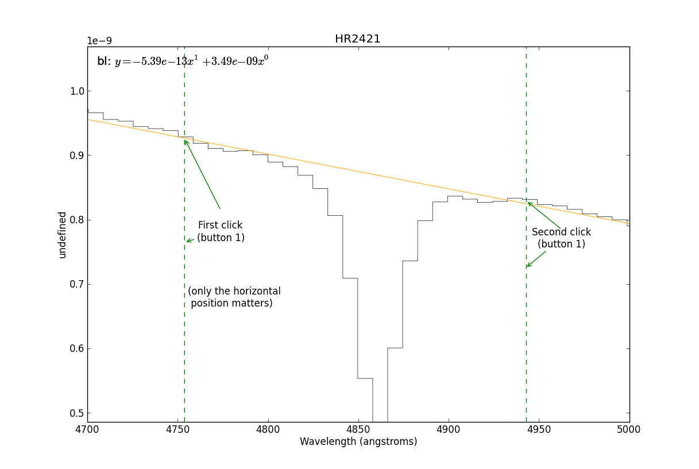

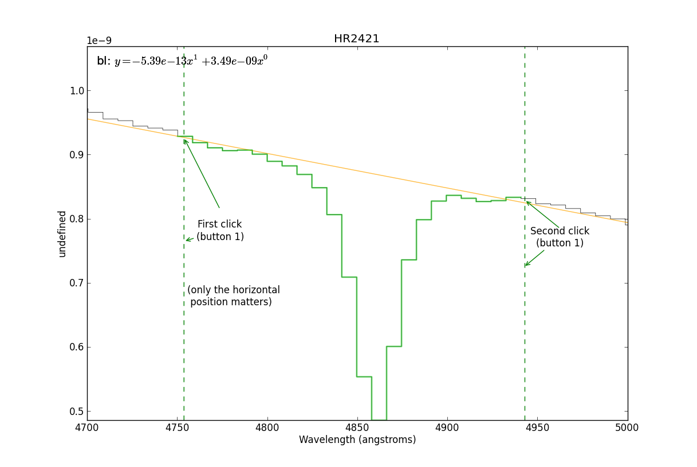

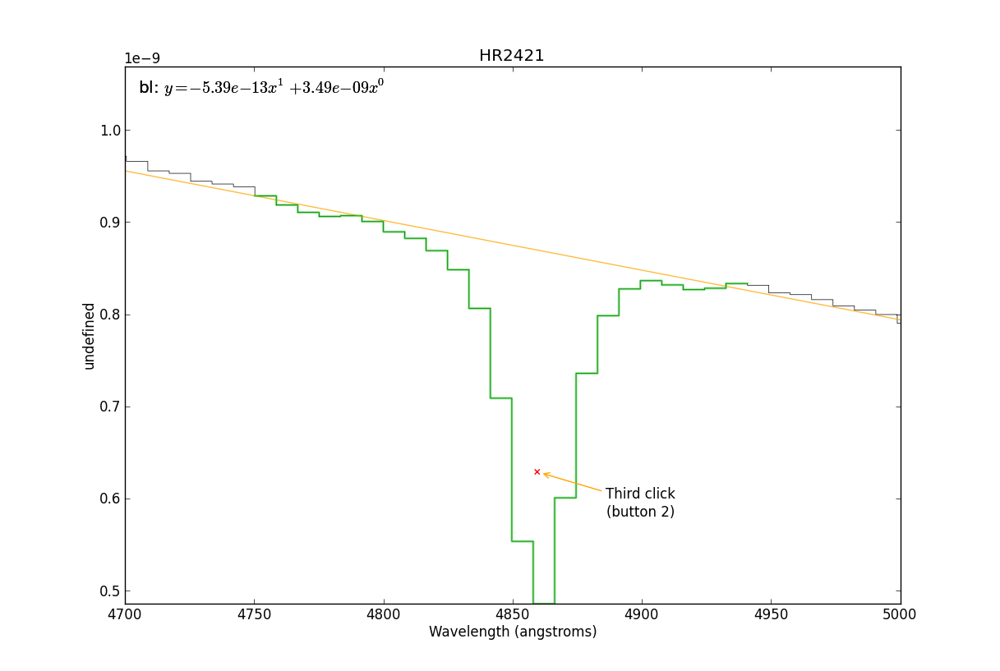

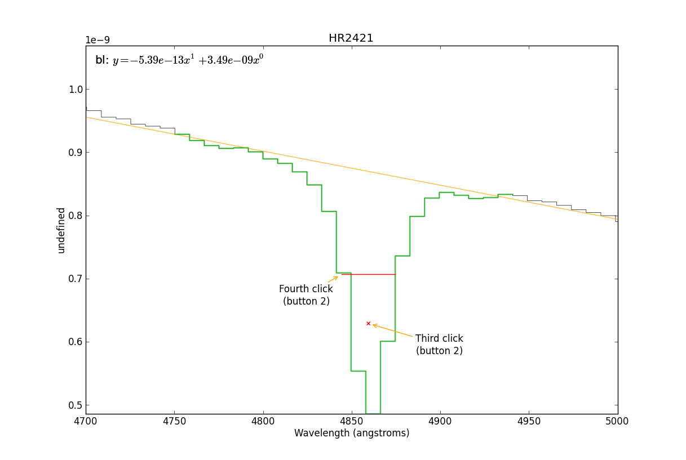

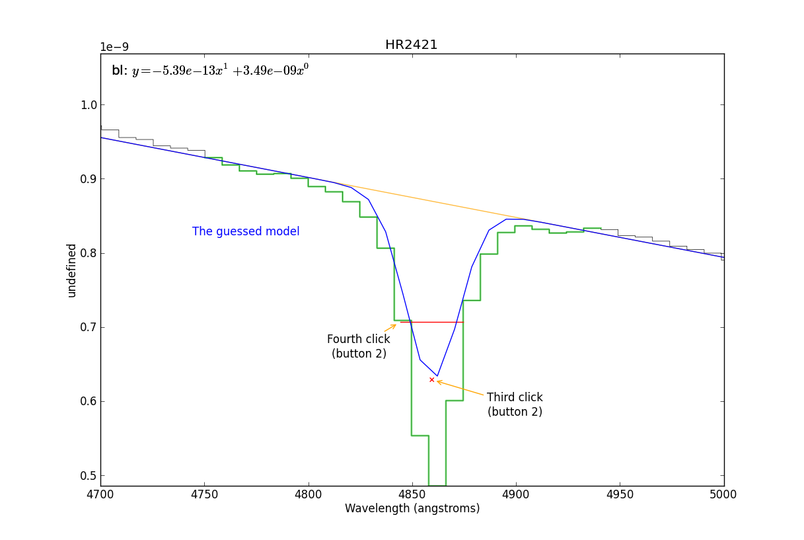

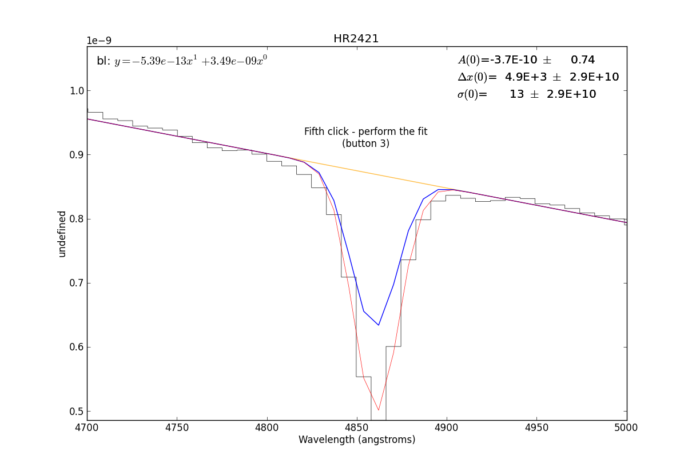

