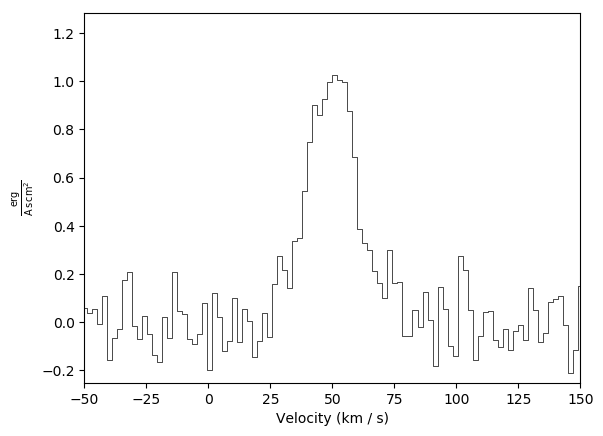
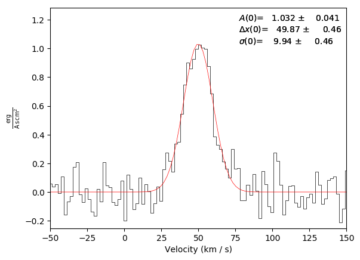
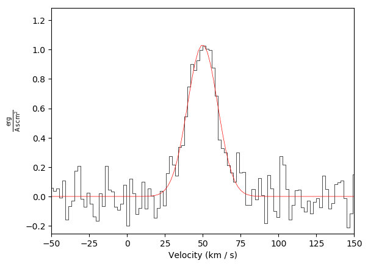
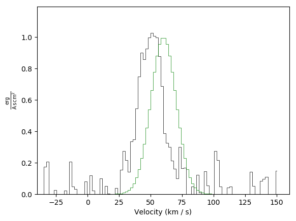
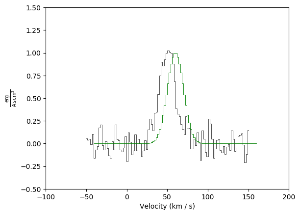
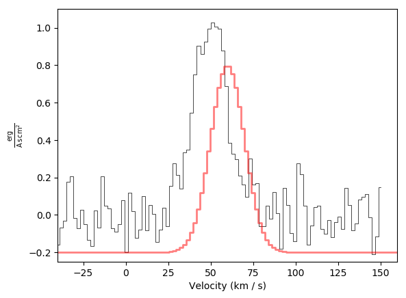

Basic Plotting Guide
====================

The plotting tool in pyspeckit is intended to make publication-quality plots
straightforward to produce.

For details on the various plotting tools, please see the `examples` and the
`plotter documentation <pyspeckit.spectrum.plotters.Plotter>`.

A few basic examples are shown in the snippet below, with comments describing
the various steps.  This example (https://github.com/jmangum/spectrumplot)
shows how to use pyspeckit with `spectral_cube
<https://spectral-cube.readthedocs.io/en/latest/index.html>`_
to extract and label spectra.  Other examples:

.. literalinclude:: basic_plot.py
   :language: python

Basic plot example:

Basic plot example with a fit and an annotation (annotation is on by default):

Basic plot example with a fit, but with no annotation:

Basic plot example with a second spectrum overlaid in green: 

Basic plot example with a second spectrum overlaid in green plus adjusted limits:

Basic plot example with a second spectrum offset and overlaid in red, again with adjusted limits:

API Documentation for Plotting
------------------------------

We include the API documentation for the generic model and fitter wrappers here.

.. automodule:: pyspeckit.spectrum.plotters
    :members:
